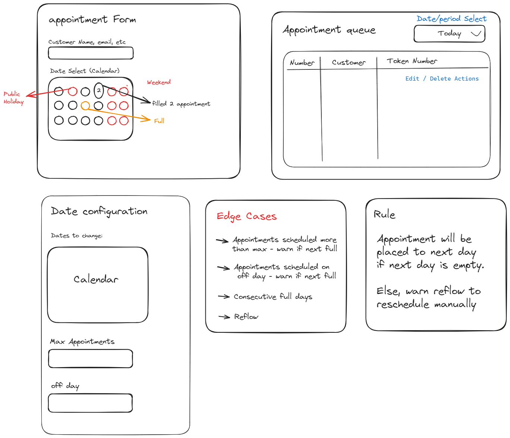

# TheAgencyApi

Welcome to TheAgencyApi project! This .NET project serves as an API backend deployed at [https://agencyapi.azurewebsites.net/swagger/index.html](https://agencyapi.azurewebsites.net/swagger/index.html).

## Architecture

TheAgencyApi follows Clean Architecture. Here's a brief overview of the project structure:

- **Controllers**
- **Data**: Houses the database context and seeding. We use Sqlite for our database.
- **Models**: Contains Data Access Object (DAO) used throughout the application.
- **Repositories**: Implements data access logic and interacts with the database using the repository pattern.
- **Services**: Contains business logic and validation.
- **DTO**: Contains Data Transfer Objects (DTO) and validation.

Note: Customer repository and service are not implemented yet.

## Database

We utilize Sqlite for our database needs. The project uses a code-first approach with automatic database creation enabled (EnsureCreated). During development, the Sqlite database file can be deleted to reset the database.

## Testing

TheAgencyApi utilizes xUnit as the testing framework for integration tests.The test coverage is still limited.

Manually, I have tested following scenarios:

- Create a new appointment in off days.
- Create a new appointment in full appointment days.
- Create a new appointment in empty days.
- Create date configuration.
- Edit date configuration.
- Create a Customer.

## Getting Started

Open the solution and run the project via dotnet cli or visual studio.

## License

CC0-1.0 License
